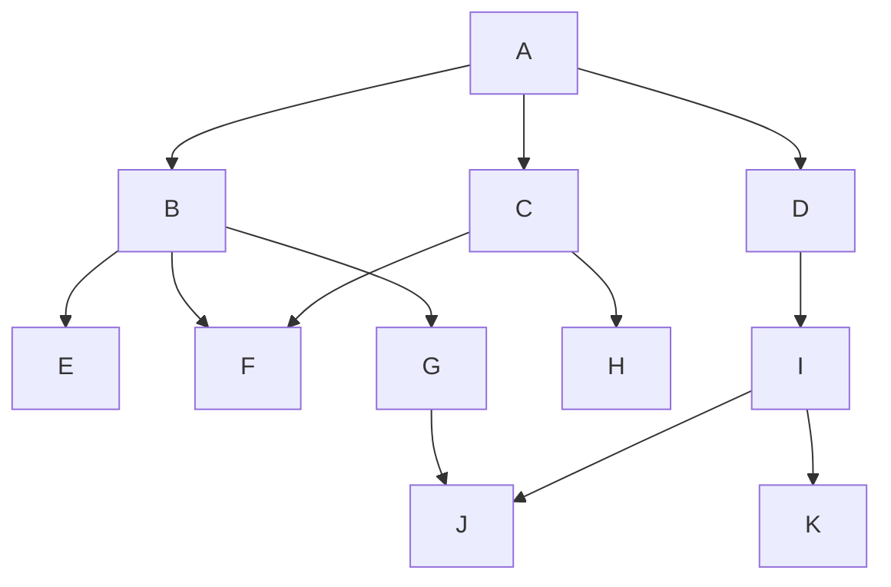
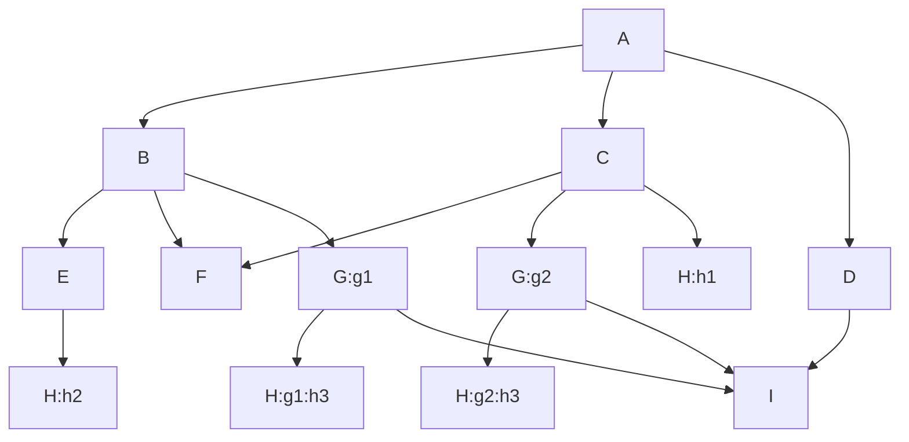

## 可重复组件

默认情况下，声明的组件是唯一的，即它无论在包含结构中出现了多少次，最终在对象内都只会存在一个组件。

如果您需要令一个组件可以在对象中存在不止一个，那么你需要使用`repeat`关键字去修饰这个组件，形式如下：

```ecp
repeat comp Position(var x = 0, var y = 0){
  fun move(dx: Int, dy: Int){
    x += dx
    y += dy
  }
}
```

此时，此组件即可在组合当中重复的出现。

### 组件拍扁

在构造组合类型时，组合包含的组件列表会被迭代地完全展开，并使得未被标记为可重复的组件只保留一个。

如果我们将组合的组件包含列表按照组件包含结构视作一个**树**，每一个组件都是此依赖树的节点，那么在组合时此树会被拍扁为线性序列，而此序列即对此树的**层次遍历**，对于如下所示的组件声明结构：

```ecs
comp A: B, C, D
comp B: E, F, G
comp C: F, H
comp D: I
comp E
comp F
comp G: J
comp H
comp I: J, K
comp J
comp K
```

以上这个结构的图示如下：



其拍扁后的线性序列依次为上述每一层首位连接在一起：**`(A), (B, C, D), (E, F, G, H, I), (J, K)`**，也就是：**`A, B, C, D, E, F, G, H, I, J, K`**

其中重复的不可重复组件都被指向了同一个组件，如果组件是可重复的，那么其展开方式会有所差异，请继续阅读。

### 组件别名

在组件或组合的包含组件列表中，对组件的包含可以声明组件的别名，通常对不可重复的组件而言是多余的，因为不可重复组件可以使用组件名称进行选取，但仍然可以为任何包含的组件分配别名，之后只能使用别名对组件进行访问。

可重复组件则必须要分配其别名，否则将无法确定对其成员的引用。组件的别名在包含组件列表中声明，它的语法如下：

```ecs
repeat comp Component(val str: String)

comp Example: Component("hello") as comp1, Component("world") as comp2
```

在组合中，当可重复组件的数量大于1，则对对象直接访问在此组件中有重名的成员就不再适用了，必须采用组件的别名去访问组件的空间，如下所示：

```ecs
val example = new Example()

println(example:comp1.str)
println(example:comp2.str)
```

上述代码中两个组件被分配了不同的变量值，之后的打印会分两行打印出`hello`和`world`

### 可重复组件的拍扁

可重复组件在树展开时不会因重复而剔除，或者说，它们会被视为独立的节点，而不会被共用，例如如下声明：

```ecs
comp A: B, C, D
comp B: E, F, G
comp C: F, G, H as h1
comp D: I as i1
comp E: H as h2
comp F
repeat comp G: H as h3, I as i2
repeat comp H
comp I
```

它的树形图如下：



那么，这个图的线性序列就是：**`(A), (B, C, D), (E, F, G:g1, G:g2, H:h1), (H:h2, H:g1:h3, H:g2:h3, I)`**，即：**`A, B, C, D, E, F, G:g1, G:g2, H:h1, H:h2, H:g1:h3, H:g2:h3, I`**

可以看到可重复组件包含的不可重复组件仍然会被剔除多余包含，全部都会被集中到同一个组件上。

但是在可重复组件内包含可重复组件时，会进一步的展开重复组件并为其迭代的分配附加别名空间，当你在上述这个结构中需要访问组件`H`的成员时，会需要二级空间来确定组件，如下所示：

```ecs
val a = new A()

a:g1:h2.xxx()
a:g2:h3.yyy = "hello"
a:g2:h2.zzz = 12345
```

也仅在可重复组件再次展开可重复组件时，才应当使用多级的别名访问。
