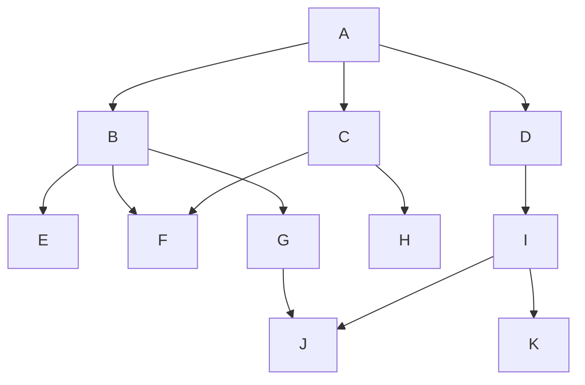

## 可重复组件

默认情况下，声明的组件是唯一的，即它无论在包含结构中出现了多少次，最终在对象内都只会存在一个组件。

如果您需要令一个组件可以在对象中存在不止一个，那么你需要使用`repeat`关键字去修饰这个组件，形式如下：

```ecp
repeat comp Position(var x = 0, var y = 0){
  fun move(dx: Int, dy: Int){
    x += dx
    y += dy
  }
}
```

此时，此组件即可在组合当中重复的出现。

### 组件拍扁

在构造组合类型时，组合包含的组件列表会被迭代地完全展开，并使得未被标记为可重复的组件只保留一个。

如果我们将组合的组件包含列表按照组件包含结构视作一个**树**，每一个组件都是此依赖树的节点，那么在组合时此树会被拍扁为线性序列，而此序列即对此树的**层次遍历**，对于如下所示的组件声明结构：

```ecs
comp A: B, C, D
comp B: E, F, G
comp C: F, H
comp D: I
comp E
comp F
comp G: J
comp H
comp I: J, K
comp J
comp K
```

以上这个结构的图示如下：



其拍扁后的线性序列依次为上述每一层首位连接在一起，即：**`A, B, C, D, E, F, G, H, I, J, K`**
